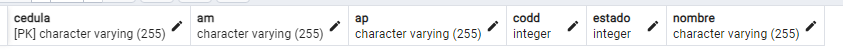

> [!CAUTION]
>**puerto utilizado:** http://localhost:9090
> 
> [Carpeta](https://github.com/jjehu/taller1-springboot/tree/main) - [`Descargar`](https://github.com/jjehu/taller1-springboot/archive/refs/heads/main.zip)

## [proy1](/proy1)
vid 1-3 / 10ago : http://localhost:9090/api/prueb
> [!NOTE]
> Dependencias utilizadas:
> - springweb

> [!TIP]
> En `proy1` se realiza:
> - creacción del proyecto utilizando [spring initializr](https://start.spring.io/).
> - creación de `proy1/src/main/java/com/pyto/taller/controller/Prueba.java` [link](proy1/src/main/java/com/pyto/taller/controller/Prueba.java) (controlador y la clase prueba).
> - cambio del puerto del servidor `proy1/target/classes/application.properties` [link](proy1/target/classes/application.properties) mediante `server.port=9090`.

## [proy2](/proy2)
vid 4-14 / 10ago : http://localhost:9090/api/personal
> [!IMPORTANT]
> *Se requiere crear la BD en postgresql de acuerdo a las propiedades del proyecto `application.properties`, en este caso la BD se llamará* `academia`
> ```sql
> CREATE DATABASE academia;
> ```
> *creamos las tablas*
> ```sql
> create table personal(
> 	codper serial not null,
> 	nombre varchar(40) not null,
> 	ap varchar(40),
> 	am varchar(40),
> 	estado integer default 1 not null,
> 	primary key(codper)
> );
> ```
> *insertamos datos y realizamos una consulta*
> ```sql
> insert into personal values(1, 'JOSE','MIRANDA','MERCADO',1);
> insert into personal values(2, 'RAUL','ARANDIA','GUZMAN',1);
> select * from personal;
> ```

> [!NOTE]
> Dependencias utilizadas:
> - springweb
> - posgresql
> - jpa
> - jdbc

> [!TIP]
> En `proy2` se realiza:
> - Insertacion de dependencias en el `pom.xml`:
> 	- posgresql
> 	- jpa
> 	- jdbc
>  - creación de BD en postgresql
>  - creación de:
> 	- `proy2/src/main/java/com/pyto/taller/controller/PersonalController.java` [link](proy2/src/main/java/com/pyto/taller/controller/PersonalController.java)
>  	- `proy2/src/main/java/com/pyto/taller/model/PersonalModel.java` [link](proy2/src/main/java/com/pyto/taller/model/PersonalModel.java)
>  	- `proy2/src/main/java/com/pyto/taller/repository/PersonalRepo.java` [link](proy2/src/main/java/com/pyto/taller/repository/PersonalRepo.java)

## [proy3](/proy3) - Lombok

vid 1-4 / 12ago : http://localhost:9090
> [!IMPORTANT]
> **PARA INSTALAR LOMBOK**
> *Dependencia*
> ```xml
> 	<dependency>
> 		<groupId>org.projectlombok</groupId>
> 		<artifactId>lombok</artifactId>
> 		<optional>true</optional>
> 	</dependency>
> ```
> *plugin*
> ```xml
> 	<build>
> 		<plugins>
> 			<plugin>
> 				<groupId>org.springframework.boot</groupId>
> 				<artifactId>spring-boot-maven-plugin</artifactId>				
> 				<configuration>
> 					<excludes>
> 						<exclude>
> 							<groupId>org.projectlombok</groupId>
> 							<artifactId>lombok</artifactId>
> 						</exclude>
> 					</excludes>
> 				</configuration>				
> 			</plugin>
> 		</plugins>
> 	</build>
> ```
> https://projectlombok.org/setup/eclipse
> ```
> https://projectlombok.org/p2
> ```

> [!NOTE]
> Dependencias utilizadas:
> - springweb
> - posgresql
> - jpa
> - jdbc
> - lombok

> [!TIP]
> En `proy3` se realiza:
> - Instalación de Lombok en el `pom.xml`
> - Cambios en el [PersonalModel]() utilizando Lombok

>
> Sintax:
> 
> (se pone a la clase para que se genere automaticamente para todos)
> - `@Getter` para generar getter
> - `@Setter` para generar setter
> - `@AllArgsConstructor` para generar los constructores
> - `@Data` para crear todos los anteriores, entre otros
> 
> (se pone a la variable para no generar)
> - `@Getter(AccessLevel.NONE)`
> - `@Setter(AccessLevel.NONE)`

## [proy4](/proy4)

vid 4-7 / 12ago : http://localhost:9090/datos  -  http://localhost:9090/datosconDTO

*Esto se realiza para que la api solo pase el login y token de la clase Datos, para esto creamos unas clases y interfaces auxiliares llamada `DTO` para diferenciarlas*

> [!NOTE]
> Dependencias utilizadas:
> - springweb
> - posgresql
> - jpa
> - jdbc
> - lombok

> [!TIP]
> En `proy4` se realiza:
> 1. Se crea en el paquete `model.dto` la clase `proy4/src/main/java/com/pyto/taller/model/dto/DatosDTO.java` [link](proy4/src/main/java/com/pyto/taller/model/dto/DatosDTO.java)
> 2. Se crea en el paquete `services.dto` la interface `proy4/src/main/java/com/pyto/taller/service/DatosService.java` [link](proy4/src/main/java/com/pyto/taller/service/DatosService.java)
> 3. Se crea en el paquete `services.dto` la clase `proy4/src/main/java/com/pyto/taller/service/DatosServiceImpl.java` [link](proy4/src/main/java/com/pyto/taller/service/DatosServiceImpl.java)
> 4. En la clase `DatosController` [link](proy4/src/main/java/com/pyto/taller/controller/DatosController.java) se añade `@GetMapping("/datosconDTO")`
>
> En `proy4` a comparacion de `proy3` se añade ademas las clases necesarias para que sirva DatosDTO como:
> - `Datoscontroller` proy4/src/main/java/com/pyto/taller/controller/DatosController.java [link](proy4/src/main/java/com/pyto/taller/controller/DatosController.java)
> - `DatosModel` proy4/src/main/java/com/pyto/taller/model/DatosModel.java [link](proy4/src/main/java/com/pyto/taller/model/DatosModel.java)
> - `DatosRepo` proy4/src/main/java/com/pyto/taller/repository/DatosRepo.java [link](proy4/src/main/java/com/pyto/taller/repository/DatosRepo.java)

> [!IMPORTANT]
> ```sql
> create table datos(
> 	login varchar(40) not null,
> 	cedula varchar(40) not null,
> 	clave varchar(40) not null,
> 	estado integer default 1 not null,
> 	primary key(login)
> );
> 
> insert into datos values('JOSE','102748135','jose123',1);
> insert into datos values('RAUL','102742157','raul123',1);
> select * from datos;
> ```

## [proy5](/proy5)
vid 1-4 / 16ago : http://localhost:9090

*`proy5` tiene como base el `proye01_clase1_v2.zip` de aulas*
> [!NOTE]
> Dependencias utilizadas:
> - springweb
> - posgresql
> - jpa
> - jdbc
> - lombok

> [!TIP]
> En `proy4` se realiza:
> - Se crea `DatosDtoI` (interface) [link]()
> - Añadimos a `DatosRepo` [link]()
> - Se crea `DatosService` (interface) [link]()
> - Se crea `DatosServiceImpl` (clase) [link]()
> - Editamos `DatosController` [link]()


## Base de Datos
[backup de academia](resources/academia.backup)

*datos*


```sql
```
*departamentos*


```sql
```
*docentes*


```sql
```
*materias*


```sql
```
*personal*


```sql
```

---
jwt token

[.](https://docs.github.com/es/get-started/writing-on-github/getting-started-with-writing-and-formatting-on-github/basic-writing-and-formatting-syntax)
